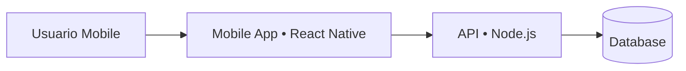
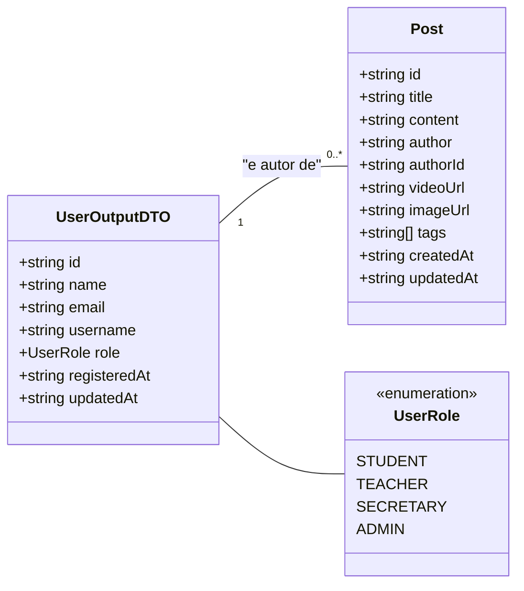
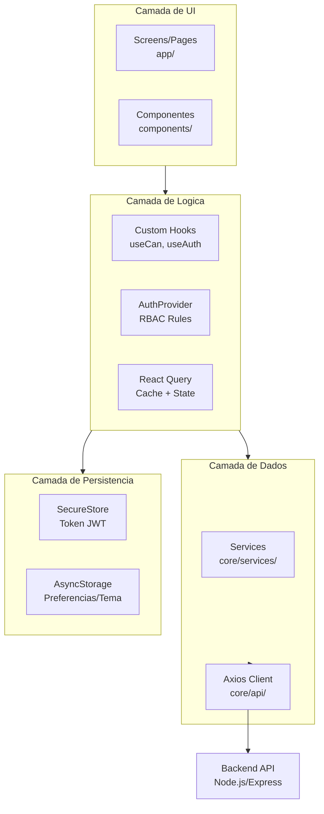
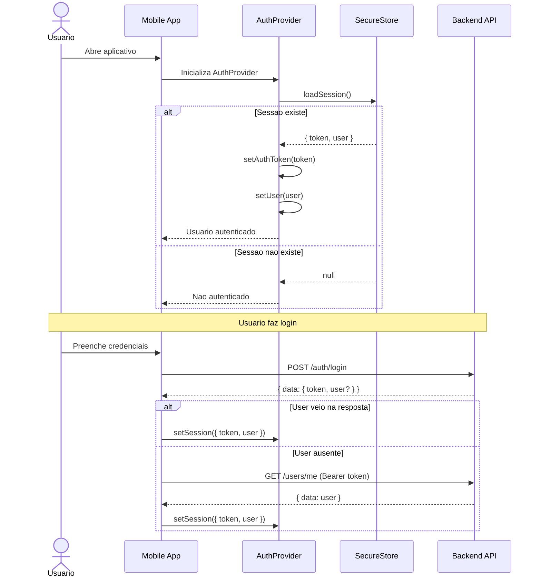
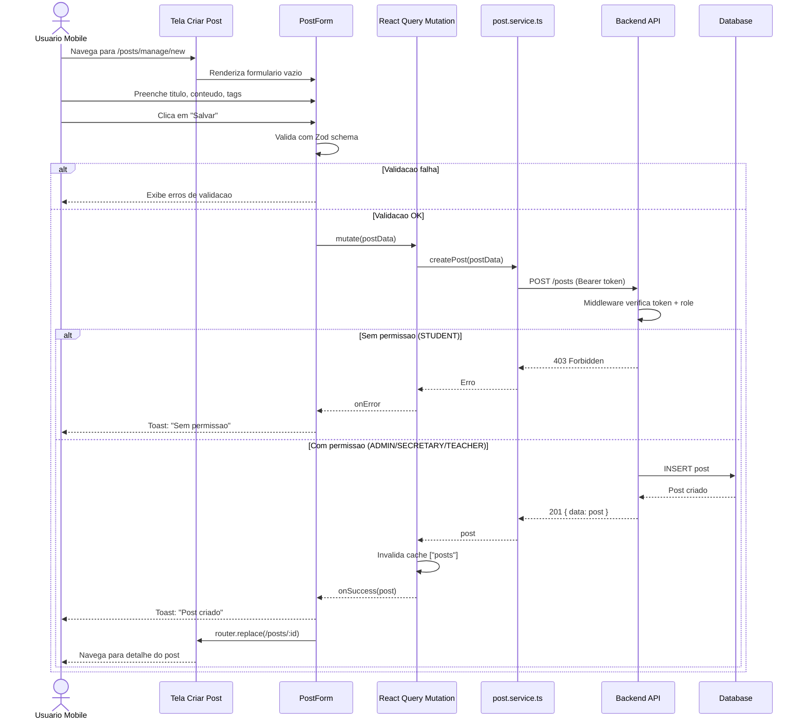
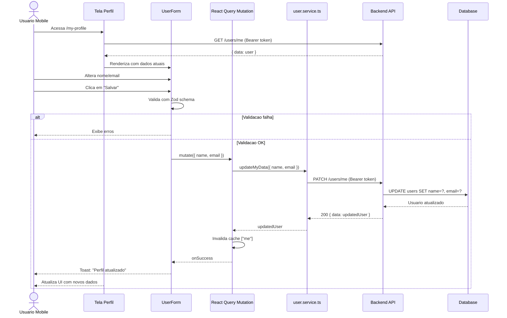

# Arquitetura, Desafios e Experiencias do Projeto Mobile

Este documento detalha a arquitetura do aplicativo mobile, as decisoes de implementacao e os desafios encontrados durante o desenvolvimento do **Ponto de Aula Mobile** (blog educacional em React Native).

---

## 1. Arquitetura do Sistema

A aplicacao e dividida em duas partes principais:

- **Mobile App**: React Native + Expo + TypeScript, com UI em NativeWind (Tailwind CSS).
- **Backend**: API REST em Node.js/Express (com JWT, RBAC e persistencia em banco de dados).

O mobile segue uma arquitetura por camadas (UI -> Logica -> Dados -> Storage), com separacao clara de responsabilidades e controle de permissoes exposto via hooks (`useAuth`, `useCan`). As regras de acesso ficam em `core/auth/rbac.ts` (posts) e `core/auth/permissions.ts` (usuarios).

### Estrutura de Pastas (Mobile)

- `app/`: Rotas e layouts (Expo Router - file-based routing)
  - `(auth)/`: Fluxo de autenticacao (login)
  - `(app)/`: Area autenticada
    - `(tabs)/`: Navegacao principal em abas (feed, meus posts, usuarios, perfil)
    - `posts/`: Telas de posts (detalhe, edicao)
    - `users/`: Telas de usuarios (criacao, edicao)
- `components/`: Componentes compartilhados
  - `ui/`: Componentes genericos (Button, Input, Fab)
  - `posts/`: Componentes especificos de posts (PostCard, PostForm)
  - `users/`: Componentes de usuarios (UserForm)
- `core/`: Logica central da aplicacao
  - `api/`: Cliente Axios e interceptors (token, 401)
  - `auth/`: AuthProvider, RBAC, roles e storage de sessao
  - `services/`: Integracao com API REST (post.service, user.service)
  - `validation/`: Schemas Zod para validacao de formularios
  - `types/`: Tipos TypeScript compartilhados
  - `constants/`: Configuracoes e env
- `lib/`: Utilitarios genericos
- `assets/`: Imagens, icones e fontes

### Diagrama de Alto Nivel

O diagrama abaixo mostra a interacao basica entre os componentes do sistema.



### Diagrama de Dados (DTOs Consumidos no Mobile)

Para entender os dados que o mobile manipula, o diagrama abaixo ilustra a estrutura dos principais DTOs consumidos das respostas da API.

Observacao: dados sensiveis como `password` **nao** sao retornados pela API para o mobile.



### Diagrama de Navegacao (Expo Router)

O Expo Router utiliza sistema file-based para rotas. A estrutura de navegacao e hierarquica com tabs e stacks aninhados.

Observacao: grupos entre parenteses (`(auth)`, `(app)`) **nao aparecem na URL final**, mas sao usados no roteamento interno.

```mermaid
graph TD
    Root[App Root<br>app/_layout.tsx] --> CheckAuth{Usuario<br>autenticado?}

    CheckAuth -->|Nao| AuthStack[Auth Stack<br>app/(auth)]
    AuthStack --> Login[Login<br>(auth)/index.tsx]

    CheckAuth -->|Sim| AppStack[App Stack<br>app/(app)]
    AppStack --> Tabs[Bottom Tabs<br>app/(app)/(tabs)]

    Tabs --> Home[Feed Posts<br>(tabs)/index.tsx]
    Tabs --> MyPosts[Meus Posts<br>(tabs)/my-posts.tsx]
    Tabs --> Users[Usuarios<br>(tabs)/users.tsx]
    Tabs --> Profile[Perfil<br>(tabs)/my-profile.tsx]

    AppStack --> PostDetail[Post Detail<br>posts/[id].tsx]
    AppStack --> PostManage[Criar/Editar Post<br>posts/manage/[id].tsx]
    AppStack --> UserManage[Criar/Editar Usuario<br>users/manage/[id].tsx]
```

### Diagrama de Arquitetura (Camadas)



---

## 2. Integracao com a API

A comunicacao entre o mobile e o backend e feita via API REST. As chamadas HTTP sao centralizadas em `core/api/client.ts` e consumidas por services em `core/services/*`.

Pontos importantes da integracao:

- **Autenticacao**: Token JWT armazenado com **Expo SecureStore** (criptografia nativa) e enviado no header `Authorization: Bearer <token>`.
- **Normalizacao de resposta**: O padrao da API e `ApiResponse<T> = { data: T }`.
- **Tratamento de erros**: Interceptors tratam 401 (logout automatico).
- **Cache inteligente**: React Query gerencia cache, invalidacao e refetch.

### Diagrama de Sequencia - Fluxo de Autenticacao Mobile

Este diagrama descreve o comportamento real do app:
- No startup: carrega sessao do SecureStore (token + usuario) e **nao** faz chamada de validacao imediata.
- No login: usa `/auth/login`; se o backend nao retornar o usuario, faz fallback para `/users/me`.



### Diagrama de Sequencia - Criacao de Post



### Diagrama de Sequencia - Edicao de Dados do Usuario



---

## 3. Decisoes Tecnicas

### Por que Expo e nao React Native CLI?

**Decisao:** Usar Expo (managed workflow) ao inves de React Native CLI puro.

**Motivacao:**
- Setup mais rapido
- Expo Router
- Bibliotecas nativas built-in
- OTA Updates
- Developer Experience

### Por que Expo Router ao inves de React Navigation?

**Decisao:** Usar Expo Router para navegacao.

**Motivacao:**
- File-based routing
- Type-safety
- Deep linking
- Layouts aninhados
- Compatibilidade com web (expo web)

**Exemplo (roteamento interno):**
```
app/(auth)/index.tsx -> /(auth)
app/(app)/(tabs)/index.tsx -> /(app)/(tabs)
app/(app)/posts/[id].tsx -> /(app)/posts/:id
```

### Por que React Query ao inves de Redux?

**Decisao:** Usar React Query (TanStack Query) para gerenciamento de estado de servidor.

**Motivacao:**
- Cache automatico
- Invalidacao inteligente
- Loading/error states
- Menos boilerplate

**Estado Global vs Local:**
- Global (Context): autenticacao, usuario logado
- Server State (React Query): posts, usuarios, dados da API
- Local (useState): formularios, UI temporaria

### Por que Expo SecureStore ao inves de AsyncStorage?

**Decisao:** Usar SecureStore para token JWT e AsyncStorage apenas para preferencias.

**Motivacao:**
- SecureStore usa Keychain (iOS) e Keystore (Android)
- Dados sensiveis precisam de criptografia

### Por que NativeWind (Tailwind CSS)?

**Decisao:** Usar NativeWind para estilizacao.

**Motivacao:**
- Sintaxe familiar do Tailwind CSS
- Design system consistente
- Dark mode com classes `dark:`

---

## 4. Desafios Enfrentados

### Desafio 1: RBAC no Mobile

**Problema:** Implementar controle de acesso granular sem comprometer UX.

**Solucao (atual):**
- Regras de posts em `core/auth/rbac.ts` e regras de usuarios em `core/auth/permissions.ts`.
- Hook `useCan` para verificacoes condicionais na UI.
- Guard de autenticacao no layout `app/(app)/_layout.tsx`.

**Observacao:** guards de edicao por recurso (apos carregar o post/usuario) **nao** estao implementados e podem ser adicionados como melhoria.

**Exemplo (regras de posts):**
```typescript
// core/auth/rbac.ts
export const policies: Record<Role, Policy> = {
  ADMIN: {
    static: { Post: ["create", "read", "delete"] },
    dynamic: { Post: { update: isOwner } }
  },
  SECRETARY: {
    static: { Post: ["create", "read"] },
    dynamic: { Post: { update: isOwner, delete: isOwner } }
  },
  TEACHER: {
    static: { Post: ["create", "read"] },
    dynamic: { Post: { update: isOwner, delete: isOwner } }
  },
  STUDENT: {
    static: { Post: ["read"] }
  }
};
```

### Desafio 2: Persistencia de Sessao Segura

**Problema:** AsyncStorage nao e criptografado por padrao.

**Solucao:**
- SecureStore para token + usuario (sessao).
- AsyncStorage apenas para preferencias (tema).
- Logout automatico em 401 via interceptor.

**Implementacao (sessao):**
```typescript
// core/auth/storage.ts
export async function saveSession(session: StoredSession) {
  await Promise.all([
    SecureStore.setItemAsync(TOKEN_KEY, session.token),
    SecureStore.setItemAsync(USER_KEY, JSON.stringify(session.user)),
  ]);
}

export async function loadSession(): Promise<StoredSession | null> {
  // ...
}

export async function clearSession() {
  await Promise.all([
    SecureStore.deleteItemAsync(TOKEN_KEY),
    SecureStore.deleteItemAsync(USER_KEY),
  ]);
}
```

### Desafio 3: Formularios com Validacao

**Solucao:**
- React Hook Form + Zod.
- Schema dinamico de usuario com base em roles permitidas.

**Exemplo:**
```typescript
// core/validation/user.ts
export function buildUserSchema(mode: "create" | "edit" | "self-edit", allowedRoles?: Role[]) {
  if (mode === "create") {
    return CreateUserSchema.extend({
      role: z
        .string()
        .nonempty("Selecione uma funcao")
        .refine((val) => (allowedRoles ?? []).includes(val as Role), {
          message: "Role nao permitida",
        }),
    });
  }
  return UpdateUserSchema;
}
```

### Desafio 4: Navegacao em Abas + Stacks Aninhados

**Solucao:**
- Layout hierarquico com tabs em `app/(app)/(tabs)`.
- Stacks adicionais para posts e usuarios.
- Navegacao consistente com `router.push`, `router.replace`, `router.back`.

### Desafio 5: Sincronizacao de Estado entre Telas

**Solucao:**
- React Query invalidation apos mutacoes.
- Chaves de query organizadas.

### Desafio 6: Tratamento de Erros da API

**Solucao (atual):**
- Tratamento local por tela, exibindo mensagens do backend quando disponiveis.
- Toasts para feedback.

---

## 5. Integracao com o Backend

### Endpoints Utilizados

**Autenticacao:**
- `POST /auth/login` - Login com username/email + senha

**Posts:**
- `GET /posts/search` - Listar posts com filtros
- `GET /posts/:id` - Detalhe do post
- `GET /posts/mine` - Posts do usuario logado
- `POST /posts` - Criar post (ADMIN/SECRETARY/TEACHER)
- `PUT /posts/:id` - Editar post (apenas proprietario)
- `DELETE /posts/:id` - Deletar post (ADMIN ou proprietario)

**Usuarios:**
- `GET /users/me` - Dados do usuario logado
- `GET /users` - Listar usuarios (ADMIN/SECRETARY)
- `GET /users/:id` - Detalhe do usuario (ADMIN/SECRETARY)
- `POST /users` - Criar usuario (ADMIN/SECRETARY)
- `PATCH /users/:id` - Editar usuario (ADMIN)
- `PATCH /users/me` - Editar dados proprios (name, email)
- `PUT /users/me/password` - Trocar senha
- `DELETE /users/:id` - Deletar usuario (ADMIN)

### Cliente HTTP (Axios)

O token e mantido em memoria e aplicado no interceptor. Em 401, o app executa logout via handler.

```typescript
// core/api/client.ts
let authToken: string | null = null;
let onUnauthorized: (() => void) | null = null;

export const setAuthToken = (token: string | null | undefined) => {
  authToken = token ?? null;
};

api.interceptors.request.use((config) => {
  if (authToken && config?.headers) {
    config.headers.Authorization = `Bearer ${authToken}`;
  }
  return config;
});

api.interceptors.response.use(
  (response) => response.data,
  (error) => {
    if (error?.response?.status === 401) onUnauthorized?.();
    return Promise.reject(error);
  }
);
```

---

## 6. Melhorias Futuras

- [ ] Offline-first com cache persistente
- [ ] Push notifications
- [ ] Upload de imagens/videos
- [ ] Comentarios em posts
- [ ] Compartilhamento nativo
- [ ] Testes E2E (Maestro/Detox)
- [ ] CI/CD com EAS Build + EAS Update
- [ ] Analytics
- [ ] Internacionalizacao (i18n)

---

## 7. Conclusao

O projeto **Ponto de Aula Mobile** demonstra uma arquitetura mobile moderna e escalavel, com foco em:

- **Seguranca**: SecureStore para tokens e RBAC aplicado na UI
- **User Experience**: React Query para cache, loading states e toasts
- **Manutenibilidade**: Separacao de camadas e TypeScript
- **Boas praticas**: Interceptors HTTP e validacao com Zod

A integracao com o backend existente garante que as regras de negocio sejam respeitadas, com o backend como fonte de verdade para autorizacao.
